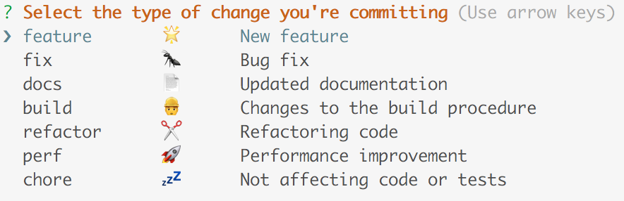
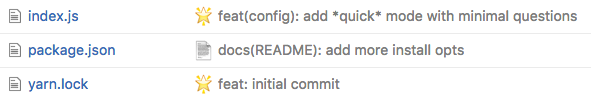
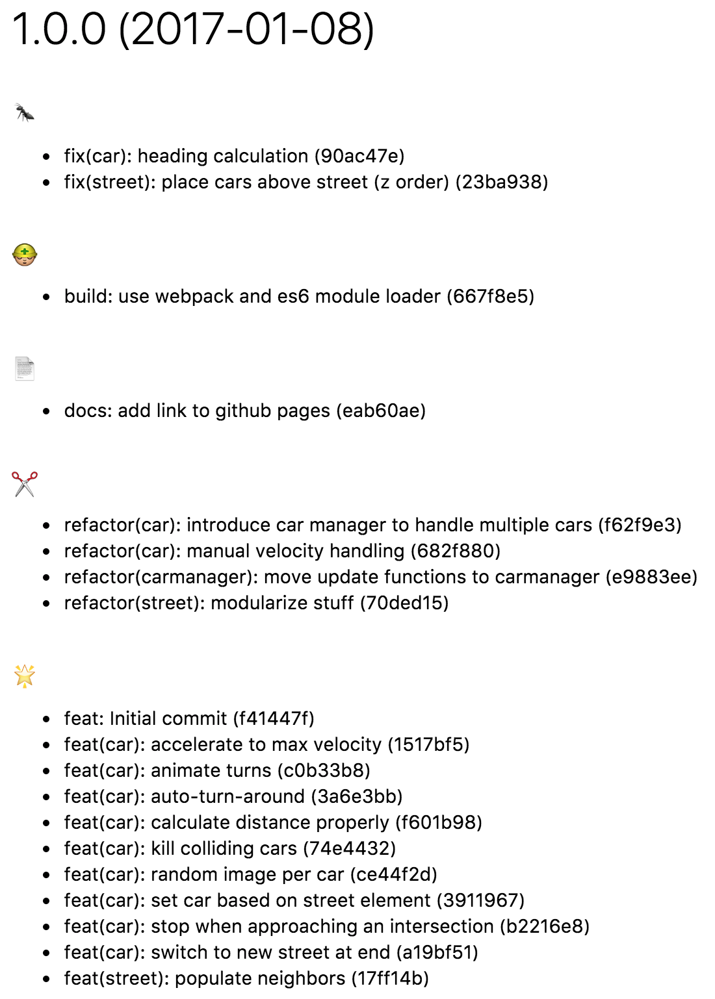

# cz-conventional-kawaii

[](https://greenkeeper.io/)

> Allow emojified commit messages and clean changelogs 🐼📄

You like emojis and think conventional changelog formatting is a good idea? Well **cz-conventional-kawaii** gives you both. It is basically a blend between `cz-conventional-changelog-atom`, `cz-conventional-changelog` and `cz-emoji`.

Together with the **atom** preset for `conventional-changelog` it gives you emojis on your git history and clean changelogs.



The default types and emojis from above give you awesome commit messages like these:



Running `conventional-changelog -p atom` will format your changelog



## Installation

You need to have [commitizen](https://github.com/commitizen/cz-cli) installed.

```sh
# install per project
$ npm i --save-dev cz-conventional-kawaii
$ commitizen init cz-conventional-kawaii

# global install for all projects
$ npm i -g cz-conventional-kawaii
$ echo '{ "path": "cz-conventional-kawaii" }' > ~/.czrc
```

## Usage

After you changed some code add it and commit using

```sh
$ git add . # add all changes
$ git cz # or git-cz
```

## Customization

You can customize **types**, **scopes** and the inquirer **questions** per project or globally.

### per project

To customize on a per project basis simply add a **config.cz-conventional-kawaii** entry to your `package.json`.

Specifying a `types` object will replace the default types. The object key will be the type used in the commit message together with the `emoji` entry.

You can also specify a fixed set of **scope** entries for your project by adding the respective field in the `package.json` config section.

Setting `quick` to a truthy value to only use the `types` and `short description` to define your commit message.

```json
..
"config": {
	"cz-conventional-kawaii": {
		"types": {
			"feat": {
				"description": "feature\t💖\tNew feature",
				"emoji": ":sparkling_heart:"
			},
			"bugfix": {
				"description": "bugfix\t🐞\tSquash them bugs!",
				"emoji": ":beetle:"
			}
		},
		"scopes": [
			"logout",
			"registration",
			"update"
		],
		"quick": true
	}
}
```

### globally

For global configuration just use the same syntax as for project level settings and put them in an **cz-conventional-kawaii** entry.

To use quick mode by default set `$HOME/.czrc` to:

```json
{
    "path": "cz-conventional-kawaii",
    "cz-conventional-kawaii": {
        "quick": true
    }
}
```

### custom adapter

To build your own *kawaii* commitizen adapter use **cz-conventional-kawaii** as a dependency and pass it your custom config.

```javascript
// myadapter.js
const convKawaii = require('cz-conventional-kawaii');
const myConfig = {
	types: {} // see lib/types.json for layout
};
module.exports = convKawaii.module(myConfig);
```
## Changelog

`v1.0.0`

- made quick mode even quicker
- added support of system wide `.czrc` configuration

## License

Inspired by https://github.com/ngryman/cz-emoji

MIT © [Andreas Offenhäuser](http://anoff.io)
